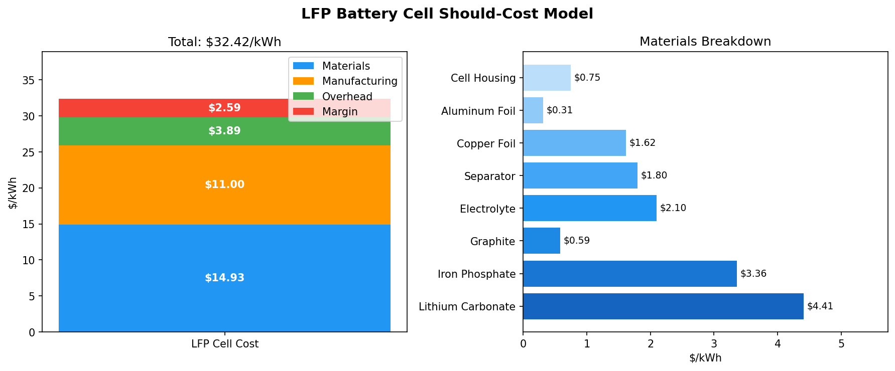
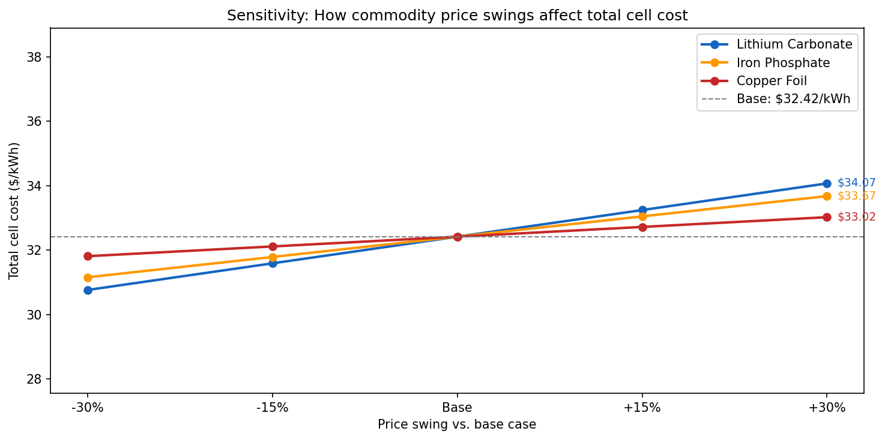

# LFP Battery Cell Should-Cost Model

A bottoms-up cost model for lithium iron phosphate (LFP) battery cells, 
outputting a fully loaded $/kWh estimate broken down by materials, 
manufacturing, overhead, and margin.

Built to understand battery procurement economics and commodity price risk 
in the context of utility-scale energy storage.

## What it models

- **Raw materials** — 8 inputs (lithium carbonate, iron phosphate, graphite, 
  electrolyte, separator, copper foil, aluminum foil, cell housing), each 
  calculated as kg/kWh × $/kg
- **Manufacturing** — labor, energy, equipment depreciation, yield loss
- **Overhead & margin** — applied as % adders on the cost subtotal
- **Sensitivity analysis** — how total $/kWh shifts when lithium, iron 
  phosphate, and copper prices swing ±30%

## Output

**Base case result: $32.42/kWh (cell-level)**  
Estimated pack-level cost ~$40.52/kWh, within range of BNEF's 2025 
LFP benchmark of ~$80–90/kWh at pack level (gap reflects pack integration 
costs not modeled: BMS, thermal management, structural housing, pack-level 
overhead).

## Key findings

- Manufacturing ($11.00/kWh) is nearly as costly as raw materials ($14.93/kWh), 
  explaining why gigafactory automation investment is as strategically important 
  as commodity hedging
- Lithium carbonate is the largest single material cost driver ($4.41/kWh)
- LFP's sensitivity curve is relatively flat and balanced across commodities 
  vs. NMC — a key reason manufacturers prefer it for stationary storage where 
  cost predictability matters more than energy density

## Methodology & sources

| Input | Source |
|-------|--------|
| Material intensities (kg/kWh) | Argonne National Lab BatPaC model |
| Cost structure / split | BloombergNEF Battery Price Survey |
| Commodity prices | LME, Fastmarkets (as of June 2026) |

## How to run

1. Clone the repo
2. Install dependencies: `pip install pandas matplotlib numpy`
3. Open `model.ipynb` in VS Code or Jupyter
4. Run all cells top to bottom

## Stack

Python · pandas · matplotlib · Jupyter
