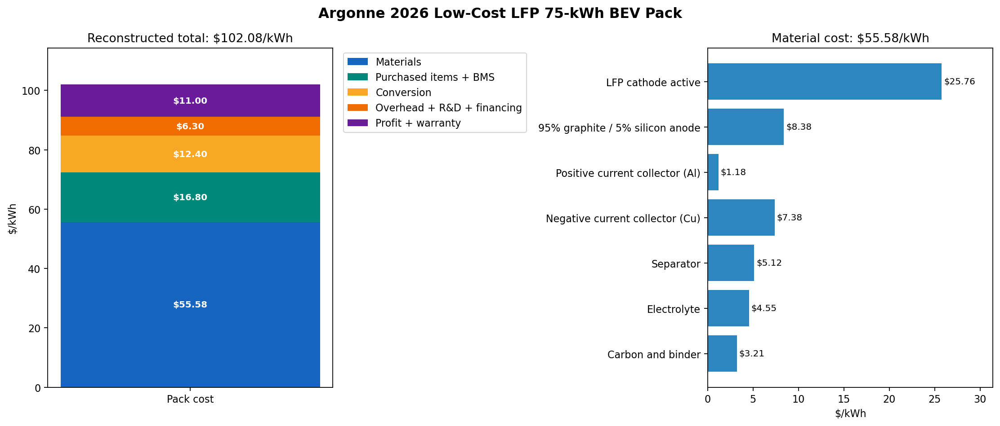
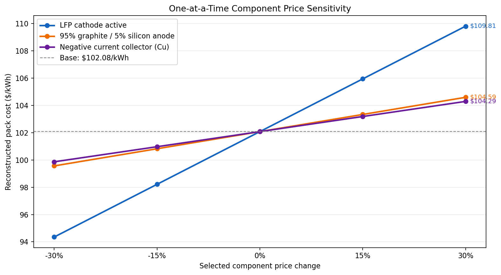

# LFP Battery Cell Should-Cost Model

A simplified, illustrative bottom-up model for thinking about lithium iron
phosphate (LFP) cell cost drivers. It decomposes a cell-level $/kWh estimate
into materials, manufacturing conversion, overhead, and supplier margin, then
tests how selected input-price changes affect the result.

This is a learning project, not a production sourcing model or a prediction of
an executable supplier quote.

## What it models

- **Raw materials** — 8 inputs (lithium carbonate, iron phosphate, graphite, 
  electrolyte, separator, copper foil, aluminum foil, cell housing), each 
  calculated as kg/kWh × $/kg
- **Manufacturing** — labor, energy, equipment depreciation, yield loss
- **Overhead & margin** — applied as % adders on the cost subtotal
- **Sensitivity analysis** — how total $/kWh shifts when lithium, iron 
  phosphate, and copper prices swing ±30%

## Output

**Illustrative base-case result: $32.42/kWh at cell level.**

Applying the notebook's simple 1.25x pack adder produces $40.52/kWh, but this
is a partial estimate and is **not within range** of BloombergNEF's 2025
reported averages of $81/kWh for LFP packs across applications and $70/kWh
for stationary-storage packs. The gap indicates that the model is incomplete,
not that it has discovered a market price below the benchmark.

## Key findings

- Under the current assumptions, manufacturing ($11.00/kWh) is a large share
  of modeled cost relative to raw materials ($14.93/kWh)
- Lithium carbonate is the largest single material cost driver ($4.41/kWh)
- A ±30% input-price change moves modeled total cell cost by approximately
  ±$1.65/kWh for lithium carbonate, ±$1.26/kWh for iron phosphate, and
  ±$0.61/kWh for copper foil

## Methodology & sources

| Input | Source |
|-------|--------|
| Topic | Reference / treatment |
|-------|-----------------------|
| Bottom-up modeling structure | [Argonne National Laboratory BatPaC v5.0](https://publications.anl.gov/anlpubs/2022/07/176234.pdf) |
| External price benchmark | [BloombergNEF 2025 Battery Price Survey release](https://about.bnef.com/insights/clean-transport/lithium-ion-battery-pack-prices-fall-to-108-per-kilowatt-hour-despite-rising-metal-prices-bloombergnef/) |
| Notebook inputs | Illustrative assumptions informed by public references; they are not direct BatPaC exports or supplier quotations |

## Important limitations

- The model treats all material intensity and pricing inputs as kg/kWh and
  $/kg. BatPaC uses different physical units for some inputs, including
  electrolyte ($/L) and separator/current-collector foil ($/m²).
- The precursor-level cathode treatment is simplified and does not reproduce
  BatPaC's full cell design and electrochemical calculations.
- Several materials and processes are omitted or aggregated, including binders,
  conductive additives, solvents, tabs/terminals, formation and aging detail,
  and some cell packaging.
- Manufacturing costs are fixed assumptions rather than functions of factory
  location, scale, utilization, process time, labor rate, equipment life, and
  yield.
- The overhead, margin, and 1.25x pack-adder assumptions are illustrative.
- Market price and should-cost are different concepts. A supplier quote also
  reflects capacity, qualification, warranty, commercial terms, geography,
  demand, and negotiating leverage.

## How to run

1. Clone the repo
2. Install dependencies: `pip install matplotlib numpy`
3. Open `model.ipynb` in VS Code or Jupyter
4. Run all cells top to bottom

## Stack

Python · pandas · matplotlib · Jupyter
